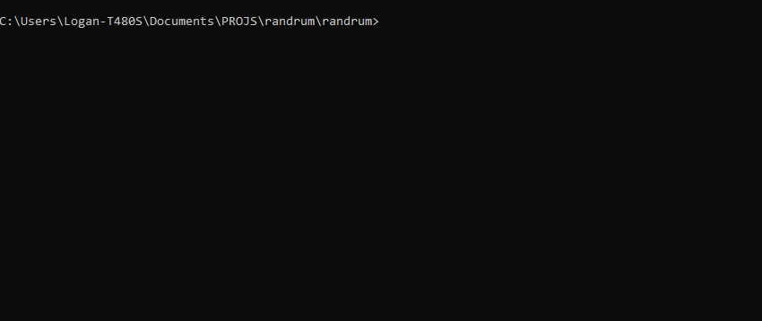

<h1>
<p align="center">
  <br>RANDRUM
</h1>
  <p align="center">
    <br />
    Random drum grooves to help break writer's block. 
    <br />
    
    <br />
    <a href="#about">About</a>
    <a href="#installation">Installation and Usage</a>
    <a href="#docs">Docs</a>
    <a href="#roadmap-and-status">Roadmap and Status</a>
  </p>
</p>

## About

RANDRUM is a CLI tool created in Rust that randomly merges individual drumhead MIDI files into full drum grooves.

## Installation
> [!WARNING]
>
> If a folder in `input/` is empty, the program will crash. I am aware of this issue. 
> If you would like to clear a certain instrument, do so by deleting all of the files within its respective folder, and replacing them with a blank `.MID` file.
> One can be found in `none/none.mid`. 
### Install
0. Ensure Rust/Cargo is installed on your machine.
```shell-session
cargo --version
```
1. Clone the repo.
```shell-session
git clone git@github.com:loganjaymes/randrum.git
```
2. Run cargo in `randrum/`.
```shell-session
cargo run --release
```
### Why No `crates.io`/`cargo install randrum`/etc.?
Due to needling supplemental files (see /input/.. and /exports/..), I have not yet figured out a way to publish to crates.io while maintaining the file structure. If anyone reading this is aware of a way to do so, I would be more than happy to do so.

## Docs
See the [documentation](DOCS.md). 

## Roadmap and Status

|  #  | Task                                                                                   | Status |
| :-: | -------------------------------------------------------------------------------------- | :----: |
|  1  | Beginning documentation                                                                |   ✅   |
|  2  | Basic functionality (randomizing given .mid files & exporting)                         |   ✅   |
|  3  | CLI                                                                                    |   ✅   |
|  4  | Add better documentation                                                               |   ⚠    |
|  5  | Implementation for time signatures other than 4/4                                      |   ❌   |
|  6  | Implementation for non-normalized midi files (fe. one .MID is 4 bars vs 8 bars)        |   ❌   |
|  7  | TUI?                                                                                   |    ~   |
